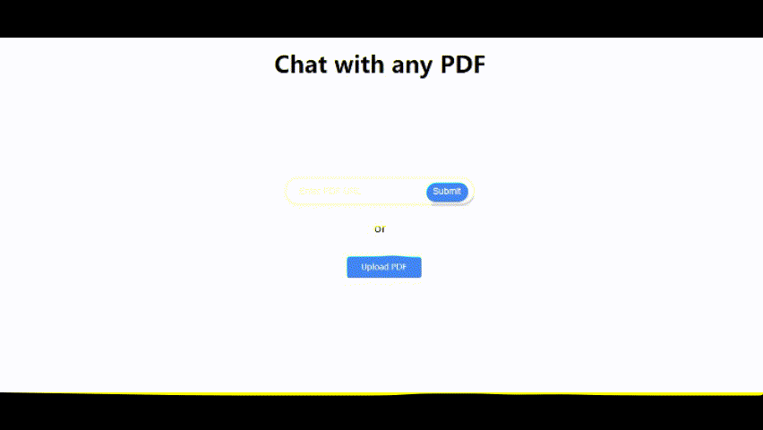

# ChatPDFLike

An end-to-end document question-answering application using large language model APIs.

**Note**: This project is not affiliated with or endorsed by [ChatPDF](https://www.chatpdf.com/). This is an independent project attempting to replicate similar functionality.

## Overview

ChatPDF-Like is a web application that allows users to upload PDF documents and interact with them using natural language queries. The application leverages large language models (LLMs) like OpenAI's GPT-3.5 Turbo to understand the content of the PDF and provide concise and accurate answers to user questions.

## Features

- **PDF Document Upload**: Upload local PDF files or provide a URL to a PDF document.
- **Natural Language Interaction**: Ask questions about the content of the PDF in natural language.
- **Relevant Answers**: Receive concise answers based on the content of the document.
- **Source References**: View sources (sections of the PDF) that were used to generate the answer.
- **Multiple LLM Providers**: Support for both OpenAI and Ollama models.
- **Web Interface**: Simple and intuitive web interface built with Flask and JavaScript.

## How It Works

The application follows these main steps:

1. **Text Extraction and Processing**:
   - The PDF is parsed using `PyPDF2`.
   - Text is extracted from each page, and large pieces of text are split into manageable chunks.

2. **Embedding Generation**:
   - For each text chunk, an embedding vector is generated using the selected embedding model (e.g., OpenAI's `text-embedding-ada-002`).
   - These embeddings represent the semantic meaning of the text chunks and are stored for similarity calculations.

3. **User Query Handling**:
   - When a user asks a question, an embedding vector for the query is generated using the same embedding model.

4. **Similarity Search**:
   - The application computes the cosine similarity between the query embedding and the text chunk embeddings.
   - The most relevant text chunks are selected based on the highest similarity scores.

5. **Prompt Construction**:
   - A prompt is created for the language model, incorporating the user's question and the most relevant text chunks.

6. **Answer Generation**:
   - The prompt is sent to the language model (e.g., OpenAI's GPT-3.5 Turbo).
   - The model generates an answer to the user's question based on the provided context.

7. **Response Display**:
   - The answer is displayed to the user in the web interface.
   - References to the source text chunks are also provided for transparency.

## Getting Started

### Prerequisites

- **Python**: Version 3.6 or higher is required.
- **API Keys**:
  - **OpenAI API Key**: Required to use OpenAI's models for embeddings and answer generation.
  - **Ollama API Key**: Optional. Required if you want to use Ollama models.

### Installation

1. **Clone the Repository**

   ```bash
   git clone https://github.com/Ulov888/chatpdflike.git
   cd chatpdflike
   ```

2. **Install Dependencies**

   Using `pip`, install the required packages:

   ```bash
   pip install -r requirements.txt
   ```

### API Keys

To use OpenAI's API:

1. Sign up for an API key at [OpenAI](https://platform.openai.com/account/api-keys).
2. Set the `OPENAI_API_KEY` environment variable:

   ```bash
   export OPENAI_API_KEY="your_openai_api_key"
   ```

To use Ollama's API (if desired):

1. Obtain an API key from Ollama.
2. Set the `OLLAMA_API_KEY` environment variable:

   ```bash
   export OLLAMA_API_KEY="your_ollama_api_key"
   ```

## Usage

1. **Start the Application**

   Run the Flask application:

   ```bash
   python run.py
   ```

   By default, the server runs on `http://0.0.0.0:8080`.

2. **Access the Web Interface**

   Open a web browser and navigate to `http://localhost:8080`.

3. **Upload a PDF Document**

   You can either:

   - Click on "Upload PDF" to select and upload a PDF file from your computer.
   - Enter a URL to a PDF document and click "Submit".

4. **Interact with the PDF**

   - Once the PDF is processed, you can ask questions about its content using the chat interface on the right side of the screen.
   - Type your question in the input box and press "Send".

5. **View Answers**

   - The application's response will appear below your question.
   - Source references (e.g., page numbers and excerpts) are provided for context.



## Customization

### Prompt Strategies

The behavior of the language model can be customized by modifying the prompt strategies in `generate_embedding.py`, specifically in the `create_prompt` method of the `Chatbot` class.

Strategies include:

- **Paper**: For summarizing scientific papers.
- **Handbook**: For summarizing financial handbooks (answers in Chinese).
- **Contract**: For understanding contracts (answers in Chinese).
- **Default**: General-purpose strategy (answers in Chinese).

To select a strategy, you can modify the `strategy` parameter when calling `create_prompt`.

### Language and Output

The application is currently configured to provide answers in Chinese for some strategies. You can modify the prompts to change the language or adjust the behavior of the model.

## Limitations

- **OpenAI API Costs**: Using OpenAI's API will incur costs based on usage. Make sure to monitor your API usage to avoid unexpected charges.
- **PDF Parsing**: The application uses `PyPDF2`, which may not handle all PDFs perfectly. Complex PDFs with unusual formatting may not parse correctly.
- **Embedding Limits**: The maximum token limit for embeddings may restrict the size of text chunks or the maximum length of the prompt.
- **Model Responses**: The quality and accuracy of the answers depend on the performance of the language model and the relevance of the retrieved text chunks.

## Contributing

Contributions are welcome! If you have any suggestions or improvements, feel free to submit an issue or pull request.

## License

This project is licensed under the [Apache License](LICENSE).
